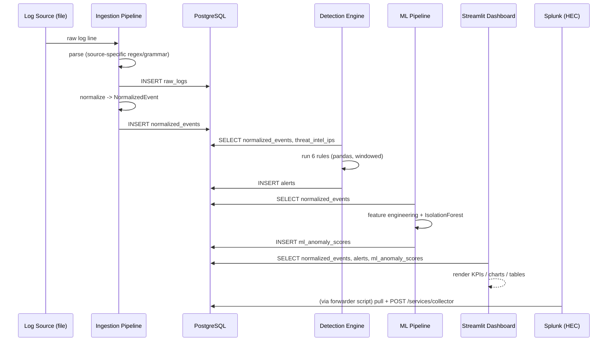
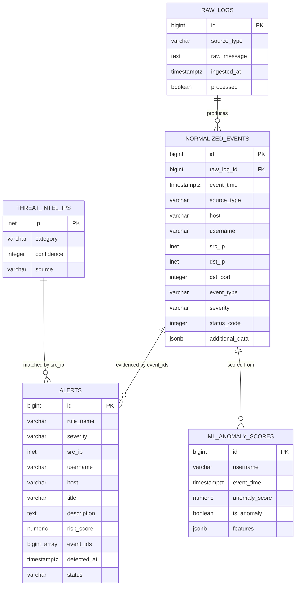

# Architecture

## Overview

The platform follows a classic SIEM pipeline shape: **collect → normalize → store → detect →
present**. Every stage is a separate, independently testable Python module so that any one
piece (e.g. swapping the ML model, or adding a fifth log source) can change without touching
the others.

## Entity-Relationship Diagram

## Why these design choices

**Normalization as the seam.** Every parser (`siem/parsers/*.py`) implements one interface:
`parse_line(str) -> NormalizedEvent`. This is the single most important design decision in the
project: it means the detection engine, the ML pipeline, and the dashboard never need to know
that a "failed login" came from a Windows event log, an SSH daemon, or a web login form.
Adding a fifth source (say, cloud provider IAM logs) means writing one new parser file, with
zero changes anywhere else.

**pandas for rule evaluation, not raw SQL loops.** The rules operate on windowed/grouped data
(e.g. "5 failures from the same IP within 5 minutes"). Expressing that in pandas keeps the
logic readable and lets every rule be unit tested against a hand-built DataFrame with no
database at all (see `tests/test_detection_rules.py`), which mattered a lot for iterating
quickly and confidently. At real production log volume this same logic would move to
windowed SQL or a stream processor (Kafka Streams/Flink); the *rule definitions* wouldn't
need to change, just their execution engine.

**Isolation Forest over supervised ML.** SOC alerting almost never has a reliable, complete set
of labeled "this was an attack" examples, and a model trained only on known attack patterns
won't generalize to novel ones anyway. Isolation Forest is unsupervised: it isolates points
that are cheap to separate from the rest of the distribution via random splits, which
empirically corresponds well to rare/anomalous behavior, without requiring any labels.

**Rule engine + ML side by side, not ML replacing rules.** This mirrors how real SOCs operate:
deterministic, explainable rules catch known attack patterns with a clear "why" (useful for
tuning, compliance, and analyst trust), while the ML layer is there to catch the things no one
wrote a rule for yet. Presenting both together, with the ML layer showing its underlying
features per login, keeps the anomaly scores interpretable rather than a black box.

**Splunk as the presentation/retention layer, not the source of truth.** Postgres is the
system of record and does all parsing/normalization/detection; Splunk receives the same
normalized events and alerts over HEC and is used purely for enterprise-grade search (SPL) and
dashboarding. This split mirrors how many real environments keep a lightweight custom pipeline
feeding into Splunk (or a SIEM/data lake) rather than trying to do 100% of the logic in SPL.

## Detection rule details

Alert persistence deduplicates on `(rule_name, event_ids)`: rerunning detection against a
history that has not changed (which happens naturally every time a scheduled job, or the live
simulator in `scripts/live_log_simulator.py`, reevaluates the full event history) will not
write duplicate alerts for evidence that already produced one. The ML pipeline instead replaces
its scored table on every run, since the model is refit on the full history each time and
scores can shift slightly as new data arrives.

| Rule | Signal | Window | Notes |
|---|---|---|---|
| `brute_force_login` | `login_failure` events grouped by `src_ip` | 5 min (configurable) | Sliding window via two-pointer scan over sorted timestamps; alert closes and restarts after firing to avoid re-alerting on the same overlapping window repeatedly. |
| `impossible_travel` | Consecutive `login_success` events per `username` | N/A (compares consecutive pairs) | Uses haversine distance between the two source IPs' geo-points ÷ time elapsed; flags if implied speed exceeds a configurable km/h ceiling (default 900, roughly commercial flight speed). |
| `suspicious_ip_threat_intel` | Any event where `src_ip` ∈ `threat_intel_ips` | N/A | Direct set-membership check against the threat intel table, refreshed from the bundled sample feed (swap-in point for AbuseIPDB/OTX/VirusTotal). |
| `privilege_escalation` | `event_type == privilege_escalation` (sudo-to-root, Windows 4672/4728) | grouped, no window | Groups by `(username, host)` so repeated escalation by the same user on the same box surfaces as one alert with a risk multiplier. |
| `unusual_login_hours` | `login_success` outside configured business hours | N/A | Simple, deliberately explainable rule that flags every off-hours login individually so an analyst can see exactly which login triggered it. |
| `multiple_failed_auth` | `login_failure` **or** `http_auth_failure`, grouped by `username` across *all* source types | 60 min (configurable) | Wider window and cross-source grouping than `brute_force_login` on purpose. This is what catches slow, low credential stuffing that hits SSH *and* a web login form from a rotating set of IPs, which per-IP brute-force detection alone would miss. |

## Scaling this beyond a portfolio project

- **Ingestion:** swap the file-based `ingest_file()` calls for a message queue consumer
  (Kafka/Kinesis) so ingestion is push-based and horizontally scalable.
- **Detection:** move the pandas rule logic to windowed SQL views or a stream processor once
  event volume outgrows what fits comfortably in memory per run.
- **Storage:** partition `normalized_events` by time (e.g. monthly) and move cold partitions to
  cheaper storage; add a TTL/archival job.
- **ML:** retrain on a schedule (e.g. nightly) rather than on every ingestion run, and persist
  the fitted model (joblib) instead of refitting from scratch each time.
- **Threat intel:** replace the bundled CSV with a scheduled job pulling from AbuseIPDB /
  AlienVault OTX / VirusTotal and upserting into `threat_intel_ips`, with no rule code changes
  needed.
