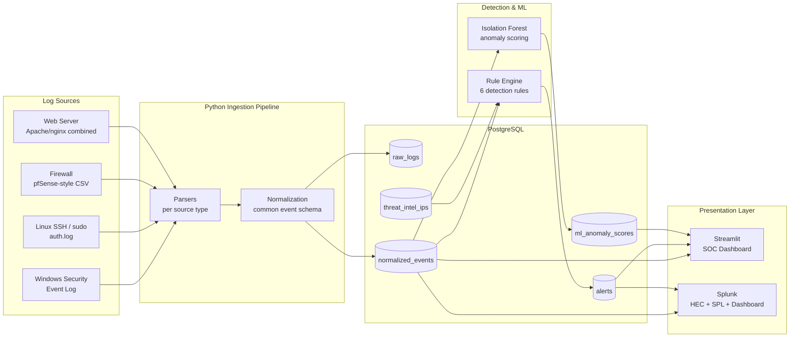

# SIEM Platform: Enterprise Style Security Information & Event Management

[](https://github.com/stsobhani/siem-platform/actions/workflows/tests.yml)

A full-stack, portfolio-grade SIEM built from scratch in Python: it ingests logs from four
different sources, normalizes them into a common schema, runs six rule-based detections plus
an unsupervised ML anomaly model, visualizes everything on a live SOC dashboard, and forwards
the same data to **Splunk** for enterprise-grade search and dashboarding.

Built to demonstrate hands-on skills for **SOC Analyst**, **Security Analyst**, and
**Security Engineer** roles: log parsing/normalization, detection engineering, threat
intelligence correlation, anomaly detection, and SIEM tooling (custom-built *and* Splunk).

> **Background:** built after 2 years in an IT internship (Tier 1 helpdesk, VM
> administration, datacenter operations) as a bridge project into cybersecurity, combining that
> sysadmin foundation with Python and data analysis skills.

> **Data notice:** this project uses synthetic security logs generated for demonstration and
> testing purposes ([`scripts/generate_sample_logs.py`](scripts/generate_sample_logs.py)). The
> logs simulate Windows, Linux, firewall, and web activity patterns, including deliberately
> embedded attack scenarios, and are not collected from any real system or user.

## Architecture



**Data flow:** raw log line → source-specific parser → normalized event (timestamp, username,
src/dst IP, event type, severity) → PostgreSQL → detection rules + ML scoring → alerts →
Streamlit dashboard *and* Splunk (via HTTP Event Collector).

See [`ARCHITECTURE.md`](ARCHITECTURE.md) for the full schema and per-component design notes.

## Screenshots

Add screenshots of your own dashboard here once you have it running (Win+Shift+S on Windows to
capture a region, save into `docs/screenshots/`, then reference them below):

```markdown


```

Good shots to capture: the KPI header with live alert counts, the alert trend and top-attacking-IP
charts, the ML anomaly scatter plot, and (if you set up Splunk) the imported Splunk dashboard
running an SPL query.

## Features

### 1. Multi-source log ingestion
| Source | Format modeled on | Example event types extracted |
|---|---|---|
| Windows Security Event Log | `Get-WinEvent` / WEF text export | login success/failure, privilege escalation (4672), group changes (4728) |
| Linux SSH & sudo | `/var/log/auth.log` syslog | login success/failure, sudo-to-root privilege escalation |
| Firewall | pfSense/OPNsense CSV export | allowed/blocked connections |
| Web server | Apache/nginx combined log format | HTTP requests, auth failures (401/403), suspicious path probes |

Every parser implements the same interface and outputs the same normalized schema
(`timestamp`, `username`, `src_ip`, `dst_ip`, `event_type`, `severity`, and more). See
[`siem/parsers/`](siem/parsers/).

### 2. PostgreSQL storage
Five tables: `raw_logs` (audit trail), `normalized_events`, `alerts`, `threat_intel_ips`,
`ml_anomaly_scores`. Schema in [`sql/init.sql`](sql/init.sql), ORM models in
[`siem/db/models.py`](siem/db/models.py).

### 3. Detection rule engine: 6 rules
| Rule | What it catches |
|---|---|
| **Brute-force login** | ≥5 failed logins from one source IP within a 5-minute window |
| **Impossible travel** | Same user logs in successfully from two geographically distant locations faster than physically possible |
| **Suspicious IP** | Any event whose source IP matches a threat-intel indicator |
| **Privilege escalation** | sudo-to-root, Windows 4672 (admin token) / 4728 (group membership change) |
| **Unusual login hours** | Successful logins outside a configurable business-hours window |
| **Multiple failed auth attempts** | ≥10 failed auth events for one user across *any* source within 60 minutes (catches slow/low, cross-vector credential stuffing that per-source brute-force detection would miss) |

Implemented in [`siem/detection/rules.py`](siem/detection/rules.py); every rule is unit tested
in isolation against synthetic data (no DB required) in
[`tests/test_detection_rules.py`](tests/test_detection_rules.py).

### 4. Machine learning: Isolation Forest anomaly detection
Every login is turned into a behavioral feature vector (hour of day, day of week, whether the
source IP is new for that user, failed attempts in the last hour, login velocity over 24h,
off-hours flag) and scored with an unsupervised Isolation Forest, requiring no labeled attack
data. See [`siem/ml/anomaly_detection.py`](siem/ml/anomaly_detection.py).

### 5. Streamlit SOC dashboard
Live dashboard showing KPI header, alert trend over time, severity breakdown, top attacking
IPs, alerts-by-rule, per-user risk scoring, a login-hour heatmap, and the ML anomaly scatter
plot. See [`siem/dashboard/app.py`](siem/dashboard/app.py).

### 6. Live data simulation
[`scripts/live_log_simulator.py`](scripts/live_log_simulator.py) continuously generates events
using the real current time, writes them straight into the database, and periodically reruns
the detection engine and the ML pipeline, so the dashboard updates the way a real live SOC feed
would rather than showing a single static snapshot. It mixes ordinary background activity with
periodic brute force bursts, threat intel hits, privilege escalation, off hours logins, and
impossible travel scenarios. Detection and ML results are deduplicated on rerun so the alert
count only grows when genuinely new evidence appears, not on every pass over old events.

### 7. Splunk integration
- [`scripts/send_to_splunk.py`](scripts/send_to_splunk.py) forwards normalized events and
  alerts to Splunk over the HTTP Event Collector (HEC) API.
- [`splunk/searches.spl`](splunk/searches.spl): 10 ready-to-run SPL queries (brute-force
  detection, top attackers, privilege escalation, risk leaderboard, multi-vector correlation,
  and more).
- [`splunk/dashboards/siem_overview.xml`](splunk/dashboards/siem_overview.xml): a Splunk
  Simple XML dashboard (KPIs, timechart by severity, top attacking IPs, risk-by-user table).

### 8. Docker, tests, docs
- `docker-compose.yml` spins up Postgres, the ingestion/detection/ML pipeline, the dashboard,
  and (optionally) a local Splunk instance, for anyone who does have Docker available.
- 31 unit tests (`pytest`) covering every parser, every detection rule, and the ML pipeline.
- Architecture diagram, ERD, and design rationale in [`ARCHITECTURE.md`](ARCHITECTURE.md).

## Quick start (Windows, no Docker)

```powershell
python -m venv venv
.\venv\Scripts\Activate.ps1
pip install -r requirements.txt

# Create the siem_user / siem database in PostgreSQL first (see below if you have not),
# then these match the project defaults so no environment variables are required.

python scripts\generate_sample_logs.py
python -m siem.ingestion.pipeline --all --init-db
python -m siem.detection.run
python -m siem.ml.run
streamlit run siem\dashboard\app.py
```

If you have not created the database yet, open `psql` as the `postgres` superuser and run:
```sql
CREATE USER siem_user WITH PASSWORD 'siem_password';
CREATE DATABASE siem OWNER siem_user;
GRANT ALL PRIVILEGES ON DATABASE siem TO siem_user;
```

## Quick start (Docker, if available)

```bash
git clone https://github.com/stsobhani/siem-platform.git
cd siem-platform
docker compose up --build
```

This starts PostgreSQL, generates sample logs, ingests and normalizes them, runs detection and
ML, and launches the dashboard at `http://localhost:8501`.

## Running the live simulator

The commands above load a fixed batch of sample logs once. To see the dashboard update the way
a live SOC feed would, leave the dashboard running in one terminal and start the simulator in a
second terminal:

```powershell
.\venv\Scripts\Activate.ps1
python scripts\live_log_simulator.py
```

It runs until stopped with Ctrl+C, writing a new batch of events every few seconds and
periodically rerunning detection and ML scoring. Click "Refresh data" in the dashboard sidebar
(or reload the page) to pull in the latest results. Useful flags:

```powershell
python scripts\live_log_simulator.py --interval 5 --duration 600 --detection-every 3 --ml-every 6
```

`--interval` is seconds between event batches, `--duration` is total seconds to run (0 means
run until stopped), and `--detection-every` / `--ml-every` control how many ticks pass between
detection and ML runs.

## Setting up Splunk locally (no Docker required)

Splunk offers a free trial of Splunk Enterprise that installs directly on Windows:

1. Download the Windows installer from
   [splunk.com/download](https://www.splunk.com/en_us/download/splunk-enterprise.html) (free
   trial, no credit card required for the 60 day trial).
2. Run the installer, set an admin password when prompted, and keep the default port (8000).
3. Once installed, Splunk Web opens at `http://localhost:8000`. Log in with the admin account
   you created.
4. Enable the HTTP Event Collector: Settings, then Data Inputs, then HTTP Event Collector, then
   New Token. Name it (for example `siem-token`), keep the default source type, and create a
   new index called `siem` when prompted. Copy the token value shown at the end.
5. Back in PowerShell, with your virtual environment active:
   ```powershell
   $env:SPLUNK_HEC_URL = "https://localhost:8088/services/collector"
   $env:SPLUNK_HEC_TOKEN = "<paste the token here>"
   $env:SPLUNK_INDEX = "siem"
   python scripts\send_to_splunk.py --what all
   ```
6. In Splunk Web, go to Search and Reporting and run `index=siem` to confirm events arrived.
   Import [`splunk/dashboards/siem_overview.xml`](splunk/dashboards/siem_overview.xml) as a new
   dashboard (Settings, then User Interface, then Views, then Create New View, then switch to
   Source and paste the XML) and try the queries in
   [`splunk/searches.spl`](splunk/searches.spl) in Search.
7. Run `python scripts\live_log_simulator.py` alongside a scheduled or repeated
   `send_to_splunk.py` call to keep Splunk populated with fresh data for screenshots or a demo.

This gives you a real, working Splunk instance with real dashboards and real SPL queries you
wrote and ran yourself, worth describing accurately in an interview.

## Deploying as a live webpage

To share this as a link rather than something that only runs on your machine, you need a
database reachable from the internet (your PC's Postgres instance is not) plus somewhere to
host the Streamlit app. Both of the following have free tiers:

1. **Hosted PostgreSQL.** Create a free database on [Neon](https://neon.tech) or
   [Supabase](https://supabase.com). Either gives you a connection string; note the host, port,
   database name, username, and password from it.
2. **Push the code to GitHub.** Commit everything except `.env` and anything else listed in
   `.gitignore` (secrets should never be committed).
3. **Deploy on Streamlit Community Cloud.** Go to
   [share.streamlit.io](https://share.streamlit.io), sign in with GitHub, choose this repo, and
   set the main file path to `siem/dashboard/app.py`.
4. **Add your database credentials as secrets**, not environment variables in code: in the
   Streamlit Community Cloud app settings, open Secrets, and add:
   ```toml
   PG_HOST = "your-neon-or-supabase-host"
   PG_PORT = "5432"
   PG_DB = "your-database-name"
   PG_USER = "your-username"
   PG_PASSWORD = "your-password"
   ```
   Streamlit loads these as environment variables automatically, which `siem/config.py` already
   reads.
5. **Load data into the hosted database once**, from your own machine, pointed at the hosted
   credentials instead of localhost:
   ```powershell
   $env:PG_HOST = "your-neon-or-supabase-host"
   $env:PG_USER = "your-username"
   $env:PG_PASSWORD = "your-password"
   $env:PG_DB = "your-database-name"
   python scripts\generate_sample_logs.py
   python -m siem.ingestion.pipeline --all --init-db
   python -m siem.detection.run
   python -m siem.ml.run
   ```
6. Your app will be live at a `share.streamlit.io` URL you can put directly on your resume and
   LinkedIn. A sidebar button in the dashboard links to Streamlit Community Cloud if you want to
   start this process from there.

Note that the free tiers of Neon and Supabase pause the database after a period of inactivity,
so the very first load after a pause can take a few seconds. Running the live simulator against
the hosted database periodically (or on a schedule) keeps it populated with fresh data.

## Running the tests

```bash
pytest tests/ -v
```

## Validation

This was built and verified end to end against a real PostgreSQL instance during development,
not just written and assumed to work. Current status:

| Check | Status | How it is verified |
|---|---|---|
| Unit tests (31 total: parsers, detection rules, ML pipeline) | Passing | Runs automatically on every push via the GitHub Actions workflow above; run locally with `pytest tests/ -v` |
| Log parsing | 190/190 sample log lines normalized successfully | `python -m siem.ingestion.pipeline --all --init-db`, check the reported normalized count against total lines |
| Detection engine | All 6 rules fire correctly against the embedded attack scenarios | `python -m siem.detection.run`, then inspect the `alerts` table |
| ML anomaly detection | Correctly flags the synthetic impossible-travel and off-hours logins as top anomalies with no labeled training data | `python -m siem.ml.run`, then inspect `ml_anomaly_scores` |
| Dashboard | Boots without errors and serves over HTTP | `streamlit run siem/dashboard/app.py` |

The unit tests are enforced automatically by CI. The pipeline-level checks (parsing rate,
which rules fire, anomaly scores) are deterministic given the bundled sample data and the fixed
random seed in the log generator, so rerunning the commands above on a clean database should
reproduce the same results.

## Tech stack

`Python`, `PostgreSQL`, `SQLAlchemy`, `pandas`, `scikit-learn` (Isolation Forest),
`Streamlit`, `Plotly`, `Docker` / `docker-compose`, `Splunk` (HEC, SPL, dashboards),
`pytest`

## Repo structure

```
siem-platform/
├── siem/
│   ├── parsers/         # one parser per log source, common NormalizedEvent output
│   ├── ingestion/       # raw to normalized to Postgres pipeline
│   ├── detection/       # 6 detection rules, threat intel, geoip
│   ├── ml/              # Isolation Forest anomaly detection
│   ├── dashboard/       # Streamlit SOC dashboard
│   └── db/              # SQLAlchemy models and session/engine
├── scripts/
│   ├── generate_sample_logs.py   # synthetic logs with embedded attack scenarios
│   ├── live_log_simulator.py     # continuous live data feed for demos
│   └── send_to_splunk.py         # HEC forwarder
├── splunk/
│   ├── searches.spl               # sample SPL queries
│   └── dashboards/siem_overview.xml
├── sql/init.sql          # schema
├── tests/                # 31 unit tests (parsers, rules, ML)
├── .streamlit/config.toml
├── docker-compose.yml
├── Dockerfile / Dockerfile.dashboard
└── ARCHITECTURE.md
```

## Notes on realism / what's simulated

This is a portfolio project, built to run anywhere with zero external API keys or paid
services, so a couple of pieces are intentionally simplified with a clear upgrade path noted
in the code:
- **GeoIP** ([`siem/detection/geoip.py`](siem/detection/geoip.py)) uses a small static
  IP-range table instead of a MaxMind GeoLite2 database, so impossible-travel detection works
  offline. Swapping in a real GeoIP database is a one-function change (`locate(ip)`).
- **Threat intel** ([`siem/detection/threat_intel.py`](siem/detection/threat_intel.py)) ships
  a small bundled CSV of sample indicators instead of a live AbuseIPDB/OTX feed. The rule
  itself only ever reads from the `threat_intel_ips` table, so pointing it at a real feed is a
  loader swap, not a rule-logic change.
- **Sample logs** are synthetically generated ([`scripts/generate_sample_logs.py`](scripts/generate_sample_logs.py))
  with deliberately embedded attack scenarios so every rule and the ML model have something to
  find immediately, but the parsers themselves are built against the real log formats
  (Windows Security Event fields, actual `auth.log` syslog grammar, pfSense CSV export, Apache
  combined log format) and will parse real logs in those formats unmodified.

## Resume bullet ideas

- *Designed and built a full-stack SIEM platform in Python/PostgreSQL that ingests and
  normalizes logs from 4 heterogeneous sources (Windows, Linux, firewall, web) and detects 6
  classes of attack (brute force, impossible travel, privilege escalation, threat-intel
  matches, off-hours access, credential stuffing).*
- *Implemented unsupervised anomaly detection (Isolation Forest, scikit-learn) over login
  behavior features, surfacing anomalous access patterns without labeled attack data.*
- *Built a live SOC analyst dashboard (Streamlit/Plotly) and integrated with Splunk (HEC, SPL,
  custom dashboards) for enterprise-grade search and visualization.*
- *Containerized the full pipeline (Docker/docker-compose) and wrote 31 unit tests covering
  parsing, detection logic, and the ML pipeline.*
